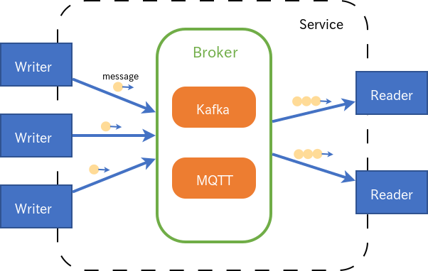

<!--
Copyright (C) 2020 National Institute of Informatics

Licensed to the Apache Software Foundation (ASF) under one
or more contributor license agreements.  See the NOTICE file
distributed with this work for additional information
regarding copyright ownership.  The ASF licenses this file
to you under the Apache License, Version 2.0 (the
"License"); you may not use this file except in compliance
with the License.  You may obtain a copy of the License at

  http://www.apache.org/licenses/LICENSE-2.0

Unless required by applicable law or agreed to in writing,
software distributed under the License is distributed on an
"AS IS" BASIS, WITHOUT WARRANTIES OR CONDITIONS OF ANY
KIND, either express or implied.  See the License for the
specific language governing permissions and limitations
under the License.
-->

## Links

* [User Guide](docs/userguide/index.en.md)
* [Performance measurement of SINETStream](docs/performance/index.en.md)
* [Developer guide](docs/developer_guide/index.en.md)
* [Build SINETStream server](https://translate.google.com/translate?hl=en&sl=ja&tl=en&u=https://nii-gakunin-cloud.github.io/sinetstream/server/brokers/index.html)
* Config Server
    * [github](https://github.com/nii-gakunin-cloud/sinetstream-config-server)
    * [manual](http://manual.config-server.sinetstream.net/manual/docs/home/index.html)
* Bridge
    * [github](https://github.com/nii-gakunin-cloud/sinetstream-bridge)
* [Update log](CHANGELOG.md)

## Concept of a messaging system

The SINETStream is a messaging system that adopts a [topic-based publish/subscribe model](https://en.wikipedia.org/wiki/Publish%E2%80%93subscribe_pattern).
It provides an abstraction layer of Broker, which in turn employs Kafka or MQTT as its backend.

The SINETStream calls the publisher as `Writer`, and the subscriber as `Reader`, respectively.

Broker's configuration and communication parameters are abstracted as `service` in the SINETStream.
Writers and Readers can communicate with any Broker just by specifying a `service`.

A logical channel in Broker is called as `topic`.
Writers and Readers send/receive a message specifying a topic, allowing different types of messages to be transferred through a Broker.

## Directory structure

* README.en.md
    * [README.en.md](README.en.md)
* python/
    * [README.en.md](python/README.en.md)
        * Build procedure of the Python version of SINETStream
    * src/
        * Common files of the Python version of SINETStream
    * plugins/
        * broker/
            * kafka/
                * Kafka-specific files of the Python version of SINETStream
            * mqtt/
                * MQTT-specific files of the Python version of SINETStream
            * s3/
                * S3-specific files of the Python version of SINETStream
        * value_type/
            * image/
                * Support for messages with image payload
        * compression/
            * lz4/
                * Sample implementation of LZ4 compression
    * sample/
        * Sample programs
* java/
    * [README.en.md](java/README.en.md)
        * Build procedure of the Java version of SINETStream
    * api/
        * Common files of the Java version of SINETStream
    * plugin-kafka/
        * Kafka-specific files of the Java version of SINETStream
    * plugin-mqtt/
        * MQTT-specific files of the Java version of SINETStream
    * plugin-s3/
        * s3-specific files of the Java version of SINETStream
    * plugin-type-image/
        * Support for messages with image payload
    * plugin-comp-lz4/
	* Sample implementation of LZ4 compression
    * sample/
        * Sample programs
* docs/
    * userguide/
        * [User guide](docs/userguide/index.en.md)
    * tutorial/
        * [Quick Start Guide (Python/Java)](docs/tutorial/index.en.md)
        * [Quick Start Guide (Android)](docs/tutorial-android/index.en.md)
    * developer_guide/
        * [Developer guide](docs/developer_guide/index.en.md)

## Operating environment
### Python/Java version

The Python/Java `SINETStream API` is implemented with following programing
languages.

* Python 3.8 or later
* Java 11

The Python/Java `SINETStream API` supports the following messaging systems.

* [Apache Kafka](https://kafka.apache.org/) 2.2.1
* MQTT v3.1, v3.1.1, v5.0
    * [Eclipse Mosquitto](https://mosquitto.org/) v1.6.2
* S3
    * AWS S3
    * [MinIO](https://min.io/)

The Python/Java `SINETStream API` runs on following operating systems.

* CentOS 7
* Ubuntu 20.04 LTS
* Windows 10

### Android version

The Android `SINETStream API` is implemented with following programing
languages.

* Java 11
* Kotlin 1.7.10

The Android `SINETStream API` supports the following messaging systems.

* MQTT v3.1, v3.1.1
    * [Eclipse Paho Android Client](https://www.eclipse.org/paho/index.php?page=clients/android/index.php)

> <em>Note</em> 
> The GitHub repository [eclipse/paho.mqtt.android](https://github.com/eclipse/paho.mqtt.android) of the `Eclipse Paho Android Client` project
> seems to have unmaintained for years.
> Due to the [system behavior changes](https://developer.android.com/about/versions/12/behavior-changes-12?hl=en#pending-intent-mutability) that have introduced in Android 12,
> using the `Paho` library on Android 12+ environment causes runtime error.
> Some volunteers have posted bugfix patches to the GitHub repository but noghing have happened so far.
> Therefore, we `SINETStream` project team have decided to use our own `PahoMqttAndroid-bugfix` library as a temporary fix.

The Android `SINETStream API` runs on following operating system.

* Android 8.0 (API level 26) or higher

> This restriction (Android 8.0+) comes from [implementation issues](https://www.mail-archive.com/dev@avro.apache.org/msg24138.html) of the `Apache Avro` library,
> which is used as `serializer/deserializer` for the `SINETStream messages`.

## Preparation
### Python/Java version

The Python/Java `SINETStream API` uses Kafka or MQTT as a backend messaging
system of Broker.
Therefore, you need to install one of these messaging systems along with SINETStream.
The tutorial package utilizes some Docker containers to install the
required software components,
i.e., SINETStream, Kafka, and MQTT.

1. Kafka broker settings
    * [Kafka Quickstart](https://kafka.apache.org/quickstart)
1. MQTT broker settings
    * [Eclipse Mosquitto: Installing](https://github.com/eclipse/mosquitto#installing)
    * [Eclipse Mosquitto: Quick start](https://github.com/eclipse/mosquitto#quick-start)
1. Installing SINETStream
    * Python: `pip3 install --user sinetstream-kafka sinetstream-mqtt`
    * Java: Please refer to the Java version of README.

Please refer to
[Quick Start Guide (Python/Java)](docs/tutorial/index.en.md)
using Docker containers.

### Android version

The Android `SINETStream API` provides client functionality
(Writer, Reader), with the support of MQTT messaging system.
Therefore, the peer Broker with an Android SINETStream client must
use MQTT only.

Note that you can use the MQTT broker part as is, which has installed
for the Python/Java SINETStream backend system.

Please refer to
[Quick Start Guide (Android)](docs/tutorial-android/index.en.md)
using a Docker container.

## License

[Apache License, Version 2.0](https://www.apache.org/licenses/LICENSE-2.0).
